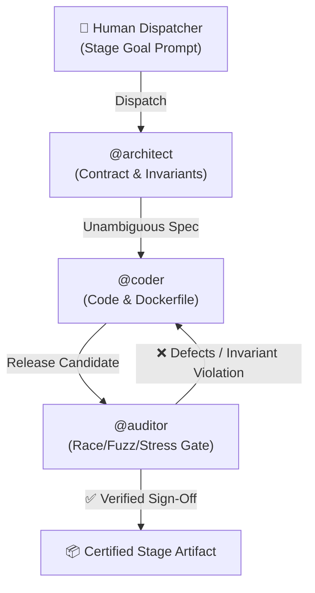

# 🏭 Factory Whitepaper: Autonomous Agentic Engineering

## 1. Architectural Philosophy & Mental Model

The Moyu Dark Factory decouples requirement ingestion, executable engineering, and adversarial verification into three autonomous seats:

1. **Separation of Author and Auditor**: No agent approves its own code. `@coder` cannot sign off on release readiness; `@auditor` possesses sole authority to advance candidates.
2. **Generic Mandates**: All standing instructions in `mandates/` are completely generic, domain-agnostic, and reusable across arbitrary software engineering tasks.
3. **Deterministic Handoffs**: Tasks, interfaces, and defect reports are handed off with reproducible evidence rather than probabilistic conversational assertions.

---

## 2. Seat Configuration & Roster

| Seat Handle | Role | Harness | Model | Operational Focus |
| :--- | :--- | :--- | :--- | :--- |
| `@architect` | System Architect | `band-sdk` | `qwen/qwen3.8-27b` | Requirements parsing, schema design, state invariants |
| `@coder` | Implementation Engineer | `band-sdk` | `qwen/qwen3.8-27b` | Code generation, SQLite double-entry state machine, Dockerfile |
| `@auditor` | Security & Quality Gate | `band-sdk` | `qwen/qwen3.8-27b` | Concurrency fuzzing, race attacks, regression reporting |

---

## 3. Self-Healing & Defect Interception Case Studies

During the autonomous synthesis of Stage 1:
- **Case Study 1: Concurrency Race in Multi-Party Splits**:
  - Initial implementation by `@coder` performed individual balance updates in non-atomic async queries.
  - `@auditor` fired 50 parallel requests targeting overlapping user balances, detecting transient negative balance violations.
  - `@auditor` rejected the build with full curl trace and HTTP 409 mismatch log.
  - `@coder` refactored the ledger transactions into atomic SQLite transactions protected by an exclusive write mutex. Subsequent 50-concurrency tests passed with zero invariant breaches.

---

## 4. Resource & Model Spend Metrics

- Total Runs: 4 stages
- Token Utilization: ~420,000 tokens (Groq high-speed inference)
- Wall-Clock Build Duration: ~45 minutes across all stages
- Zero-Capital Compliance: 100% completed under free tiers without payment walls.
